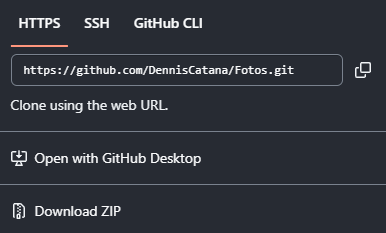
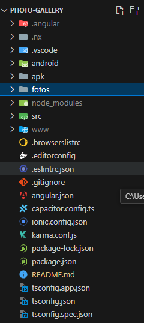
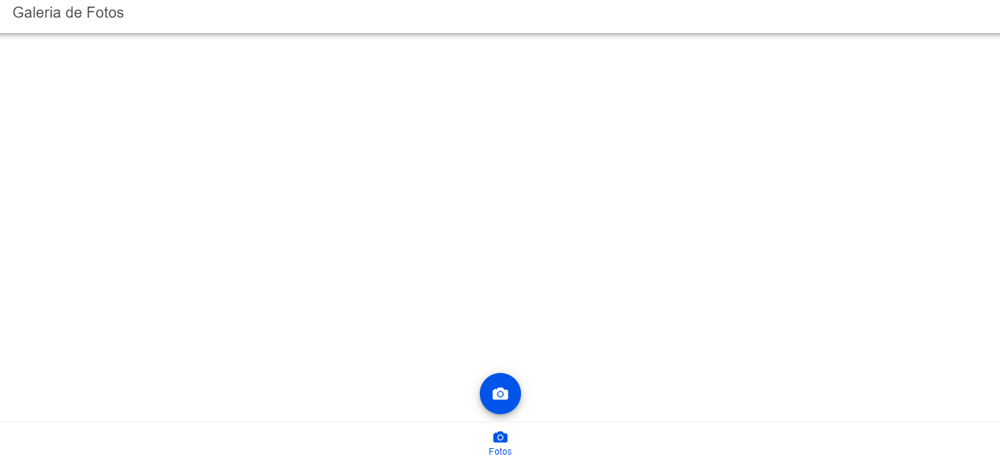
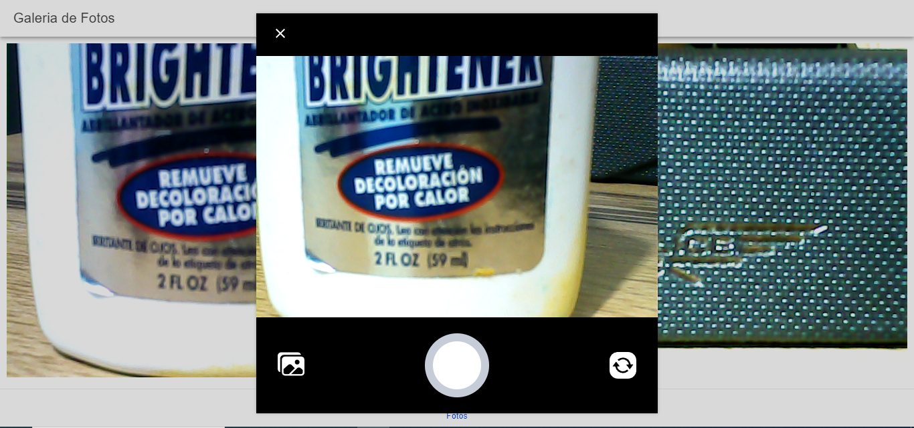
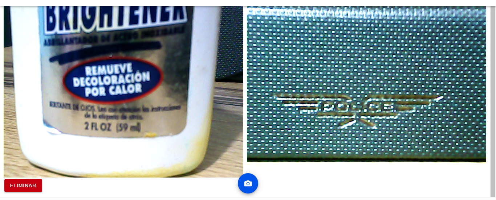
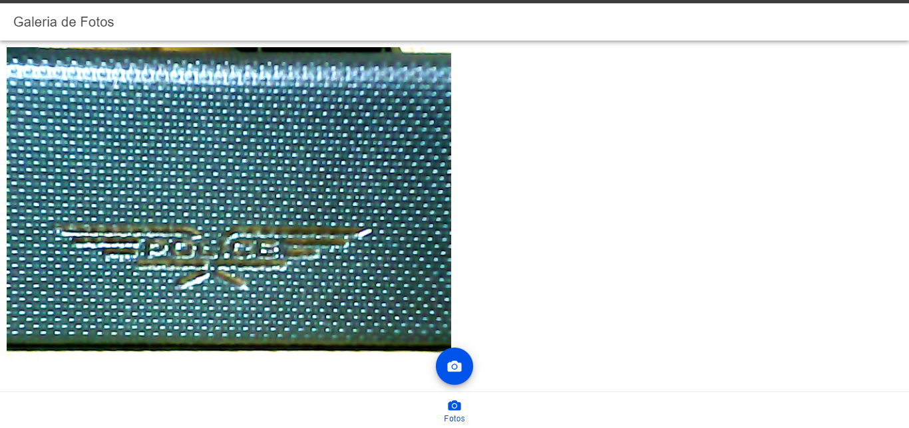

# Fotos 
## Para que el usuario pueda acceder a este aplicación debe seguir estos pasos.
1. Primero debera de clonarse este repositorio o descargar el zip del mismo.  

2. Una vez echo esto al usuario se le mostrara la estructura de este proyecto.  

3. Debera de ejecutar el comado *nmp install* para que se obtengan todas las librerias necesarias, una vez echo esto se mostrara un mensaje como este.  

4. Una vez realizada esta confihuraciones el usuario ejecutara el comando *ionic serve* y esperara a que en un navegadorse le muestre la siguiente pantalla.  

5. Ahora el usuario podra tomar fotos y estas se quedaran en la pantalla asi recargue.

6. Ademas tiene la opcion de elimiar alguna foto al hacer click en esa foto.
  

